# Traffic-flow-Cellular-Automata
An application displaying a traffic model based on cellular automata

   

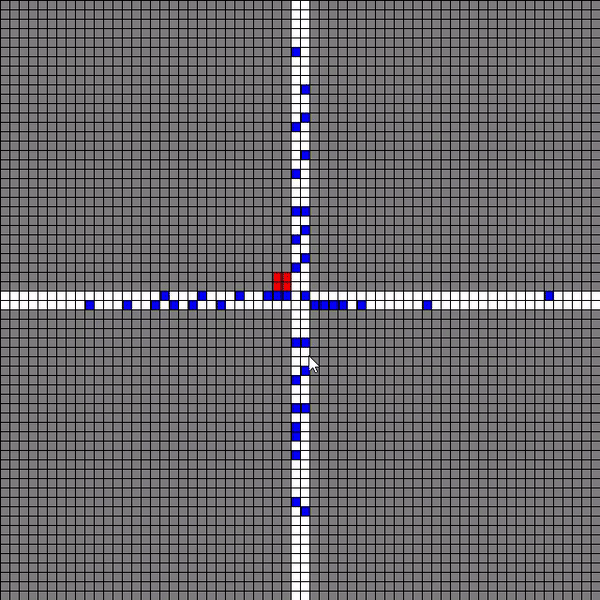

## <h2>Cellular automata</h2>
  
  
[Cellular automata](https://en.wikipedia.org/wiki/Cellular_automaton) was the main tools for modeling.
A cellular automaton consists of a regular grid of cells, each in one of a finite number of states. 
Iteration is each update of the grid of cells. 

The base for modeling extactly traffic flows was [Nagel–Schreckenberg model.](https://en.wikipedia.org/wiki/Nagel%E2%80%93Schreckenberg_model)

In my case the grid of cells contains such states as cell type, direction, move permision, velocitiy:
States = **[cell type, direction, move permision, velocity]**

Cell type is what kind of cell it represents. It can be *wall, traffic light, road, car*. **Wall** is a a state of cells which a car can't go through.
**Road** is a state of cells which a car can move. **Car** cell type for a car, **traffic light** for a traffic light.

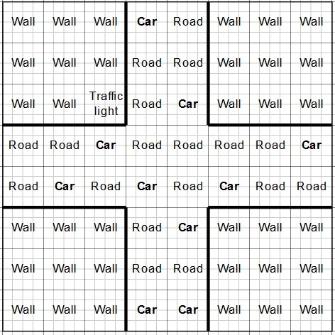

**Direction** shows the way a car can move. I did it with vectors where a value of the first index is y-coordinate, the second is x-coordinate -> (y,x). The reference point is in the top right corner, y-axis is directed to down, x-axis is directed to right. 
The first and second coordintaes with the sign(+/-) show possible movements along y-axis and x-axis respectively. If 0, it can't move. If ±1, it can move. 

Reference point and axes | Directions
-------------------------|-----------
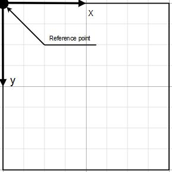 | 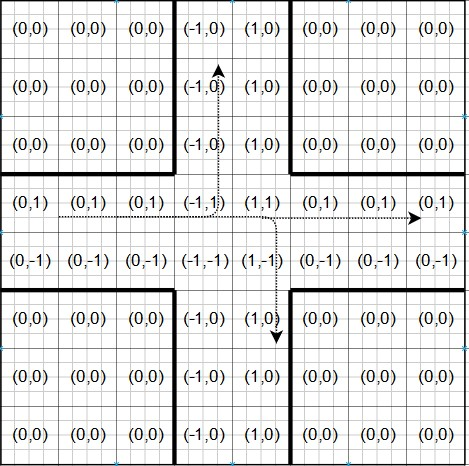

##
Here the thing. If any car tries to cross the center of the road, it will continue to move diagonally (the both coordinates allow to move). To prevent this I decided to make another states called **move permissions**. Moreover, it allows to implement a traffic light. 
The traffic light has 4 states. The *GREEN* one allows to move along x-axis, the *RED* one allows to move along y-axis, the last *RED TO GREEN* and *GREEN TO RED* are for switching from the GREEN state to the RED state. 
**Move permisions** show which flow (along x-axis or y-axis) can move through the roadcross 

Traffic light switches | Move permission for RED | Move permission for GREEN
-----------------------|-------------------------|--------------------------
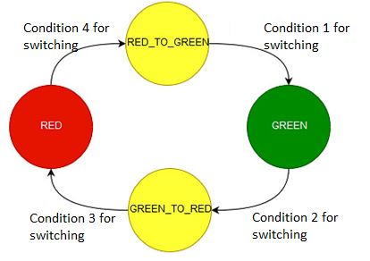 | 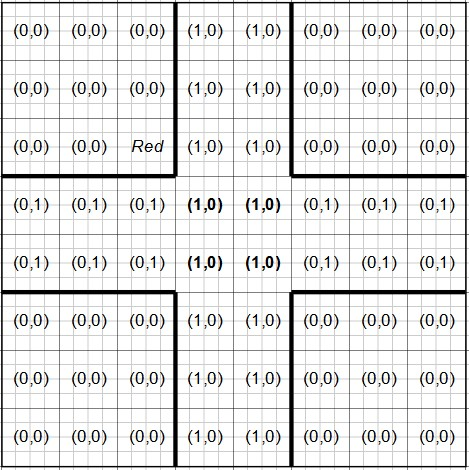 | 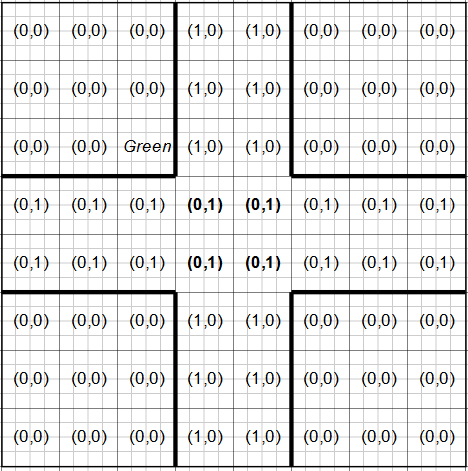 

##
**Velocities** show the speed of cars. It is represented some constant multiplicated by directions

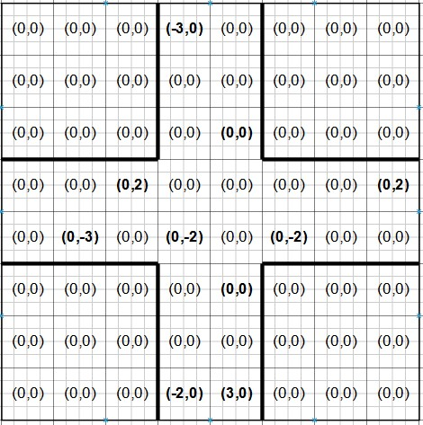 

## <h2>For what purpose</h2>

This model can be used for implementing different algotighms of the traffic light control. We can compare time delay for all cars using some **adaptive algorighm of the traffic light control (AATLC)** and *a classic algorigthm of the traffic light control (CATLC)*. AATLC takes in account the traffic congestion and tries to minimize the time delay, so It calms down drivers. CATLC switches states of traffic light after defininte time.

I tried to make the AATLC. The main idea is calculating the weights along y- and x-axes:
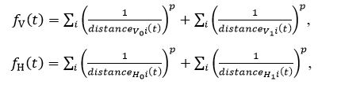

*fh* stands for the weight along the x-axis (h - horizontal),

*fv* stands for the weigth along the y-axis (v - vertical)

It calculates the distance between every car moving to the center and the center (roadcrossing)  on each line. 
After that the AATLC decides to switch the state of the traffic light or not. It depends on what state is now.

State RED | State GREEN | State GREEN TO RED / RED TO GREEN
----------|-------------|----------------------------------
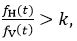 | 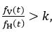 | If more than some time interval

If the present state of the traffic light is RED and fh/fv > k it switches to the RED TO GREEN state. There is the GREEN state after that.

If the present state of the traffic light is GREEN and fv/fh > k it switches to the GREEN TO RED state. There is the RED state after that.

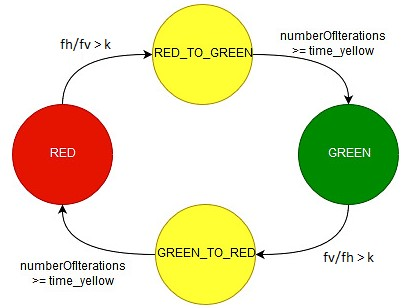

## <h2>Results</h2>
As you could see for the adaptive algorighm was used paramaters *p* and *k*. I tried different values for these parameters. The adaptive algorighm with some combinations of parameters worked definitely better than the classical algorithm. It means a driver's got temper less because of the smart controling traffic flow.  
